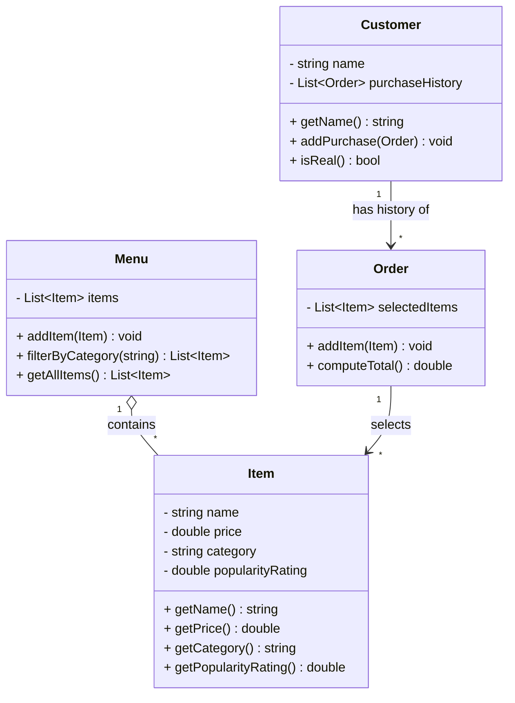

# ByteBites — UML Class Diagram Draft

Looking at the spec, here is the modeling work done the way you'd actually do UML: **identify classes first, then visualize.**

## Step 1 — Classes identified (before drawing anything)

The spec lists four *candidate* classes at the top: `Drinks, Desserts, Sides, Main`. Key modeling insight: **those are not four classes — they're four values of a single attribute (`category`).** The feature request says to "track the... category" as a property of an item. So those candidates were discarded, and the *Client Feature Request* was re-read to find the real "nouns that own data and behavior":

| Class | Why it's a class (from the spec) | Responsibility |
|-------|----------------------------------|----------------|
| **Customer** | "manage our customers, tracking their names and their past purchase history" | Represents a real user |
| **Item** | "track the name, price, category, and popularity rating for every item" | A single food/drink product |
| **Menu** | "manage the full collection of items... filter by category" | Holds all items; filtering |
| **Order** | "group them into a single transaction... store the selected items and compute the total cost" | A transaction; computes total |

The four attributes — **name, price, category, popularity rating** — all live on the **`Item`** class, because each one describes a single sellable product, not the menu or the order.

## Step 2 — The UML class diagram



If your tooling doesn't render Mermaid, here's the same model in plain boxes:

```
┌──────────────────────┐        ┌─────────────────────────────┐
│       Customer       │        │            Item             │
├──────────────────────┤        ├─────────────────────────────┤
│ - name               │        │ - name              : str   │
│ - purchaseHistory[]  │        │ - price             : double│
├──────────────────────┤        │ - category          : str   │
│ + getName()          │        │ - popularityRating  : double│
│ + addPurchase(Order) │        ├─────────────────────────────┤
│ + isReal()           │        │ + getName() / getPrice()    │
└──────────┬───────────┘        │ + getCategory()             │
           │ has history of     │ + getPopularityRating()     │
           │ 1 ──> *            └──────────────┬──────────────┘
┌──────────▼───────────┐                       │ selects 1 ──> *
│        Order         │───────────────────────┘
├──────────────────────┤        ┌─────────────────────────────┐
│ - selectedItems[]    │        │            Menu             │
├──────────────────────┤        ├─────────────────────────────┤
│ + addItem(Item)      │        │ - items[]                   │
│ + computeTotal()     │        ├─────────────────────────────┤
└──────────────────────┘        │ + addItem(Item)             │
                                 │ + filterByCategory(str)     │
                                 │ + getAllItems()             │
                  contains 1 o──> *   └─────────────────────────┘
                  (Menu o── Item)
```

## Step 3 — What the UML actually *does* for you here

- **It separates data from containers.** The diagram makes it obvious that `name/price/category/popularityRating` belong on `Item` (one per product), while `Menu` and `Order` just *hold collections* of items.
- **It exposes relationships and multiplicity.** The `1 --> *` arrows show one `Menu` holds many `Item`s, one `Order` selects many `Item`s, and one `Customer` has many `Order`s. You can't see that from a flat list of nouns.
- **It catches modeling mistakes early.** It's what told us `Drinks/Desserts/Sides/Main` are *data values*, not classes — saving you from writing four nearly-identical classes when one `Item` with a `category` field does the job.
- **It's a blueprint, not code yet.** `-` = private field, `+` = public method. You can hand this to any language (Java, Python, C#) and the structure translates directly.

**Notation note:** A hollow diamond (`o--`, aggregation) is used for `Menu`–`Item` because items can exist independently of a menu; plain arrows (association) are used elsewhere.
